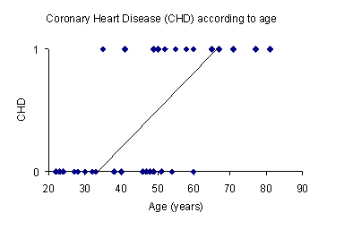

```{r setup, include=FALSE}
options(htmltools.dir.version = FALSE, width = 75)
knitr::opts_chunk$set(echo = TRUE, fig.align='center', dev='png', dpi = 95, out.width = "100%")
```


# Plan

I) Rappel
II) Introduction à la regression logistique
III) Formalisme et principe (modèle LOGIT)
IV) Estimation des coefficients beta

---

## I. Rappel (1/2)

- Y est expliquée (modélisée) par  les variables explicatives $X= (X_1,X_2,...,X_p)$
Si $p=1$, c’est une fonction affine de X

- Modèle: $E(Y)  = bX= \beta_0 + \beta_1X_1 + … + \beta_pX_p$
avec $\beta=(\beta_0, \beta_1, …, \beta_p)$ estimé par les moindres carrées 

$$\beta = argmin(\sum_{i=1}^{n} {(y_i - \beta_0 - \beta_1x_{1,i} - ... - \beta_px_{p,i})^2)}$$ 
*Sous l’hypothèse de normalité des résidus, l’estimateur des moindres carrés est équivalent à l’estimateur du maximum de vraisemblance pour la régression linéaire.*

- La valeur estimée (ajustée) de Y est $\widehat{y}_i =  \widehat{\beta}_0 + \widehat{\beta}_1X_1 +  … + \widehat{\beta}_pX_p$

- Les résidus sont estimés par $e_i = y_i -\widehat{y}_i$

- La variance du terme d’erreur est estimée par $s^2 = \frac{1}{n-2} \sum_{i=1}^{n}{e_i^2}$

---

## I) Rappel (2/2)

blabla

---

## I) Exemple

```{r}
d = read.table("data/data_nutri.csv", header=TRUE, sep=",", row.names = 1)
DT::datatable(d, width = "100%")
#head(d)
```

---

## I) Exemple

```{r}
#layout(matrix(1:2, 1), respect=TRUE)

plot(d$taille, d$poids)
# Y~B
# E(Y) = b.X
# E(Y) = b_0 + b_1.X
# Y_i = b_0 + b_1.X_i + e_i
m = lm(d$poids~d$taille)
m = lm(poids~taille, d)
#m$coefficients
#m$residuals
abline(a=m$coefficients[[1]], b=m$coefficients[[2]], col=2)
# arrows(d$taille, d$poids, d$taille+m$residuals, d$poids, col=adjustcolor(1, alpha.f=0.5))
arrows(d$taille, d$poids, d$taille, d$poids-m$residuals, col=adjustcolor(1, alpha.f=0.5))
```

---

## I) Exemple

```{r}
layout(matrix(1:2, 1), respect=TRUE)
plot(d$taille, d$poids)
# Y~B
# E(Y) = b.X
# E(Y) = b_0 + b_1.X
# Y_i = b_0 + b_1.X_i + e_i
m = lm(d$poids~d$taille)
#m$coefficients
abline(a=m$coefficients[[1]], b=m$coefficients[[2]], col=2)
plot(d$taille, d$poids-m$residuals, col=1)
arrows(d$taille, d$poids, d$taille, d$poids-m$residuals, col=adjustcolor(1, alpha.f=0.5))
```

---

## I) Exemple

```{r}
layout(matrix(1:2, 1), respect=TRUE)
plot(d$sex, d$poids)
m = lm(d$poids~d$sex)
m$coefficients
abline(a=m$coefficients[[1]], b=m$coefficients[[2]], col=2)
plot(1:nrow(d), d$poids-m$residuals, col=1)
arrows(1:nrow(d), d$poids, 1:nrow(d), d$poids-m$residuals, col=adjustcolor(1, alpha.f=0.5))
```

---

## I) Exemple

```{r}

plot(1:nrow(d), d$poids-m$residuals, col=1)
arrows(1:nrow(d), d$poids, 1:nrow(d), d$poids-m$residuals, col=adjustcolor(1, alpha.f=0.5))
abline(a=m$coefficients[[1]], b=m$coefficients[[2]], col=2)


arrows(d$taille, d$poids, d$taille + 0.5*m$coefficients[[2]]*m$residuals, d$poids - sqrt(m$coefficients[[2]]*m$residuals), col=adjustcolor(1, alpha.f=0.5))


arrows(d$taille, d$poids, d$taille + 0.5*m$coefficients[[2]]*m$residuals, d$poids - sqrt(m$coefficients[[2]]*m$residuals), col=adjustcolor(1, alpha.f=0.5))

# plot( d$poids, d$taille)
# m = lm(d$taille~d$poids)
# m = lm(taille~poids, d)
# m$coefficients
# m$residuals
# arrows(d$poids, d$taille, d$poids+m$residuals, d$taille, col=adjustcolor(1, alpha.f=0.5))
# abline(a=m$coefficients[[1]], b=m$coefficients[[2]], col=2)
#

plot(density(m$residuals))

plot(d$sexe, d$taille)
```

---

## II) Introduction à la regression logistique: objectifs

- Objectif : Modéliser une **variable binaire** en fonction d’une ou plusieurs autres covariables (quali ou quanti)

- Exemple de variable à expliquer:
-> Maladie coronarienne en fonction d’HTA et cholestérol
-> Survenue de cancer en fonction d’expositions chimiques
-> Consommation d’un bien selon variables sociodémographiques
-> Risque d’accoucher d’un bébé de faible poids (<2500g) en fonction de l’âge de la mère, du poids, du tabagisme…

- Toute variable binaire peut être **codée en 0/1**, et est alors considérée comme une variable de Bernouilli de distribution: $P(Y =1) =p$,  $P(Y=0)=1-p$ et $P(Y=k)=p^k(1-p)^{1-k}$

---

## II) Introduction à la regression logistique: Exemple de distribution

***TODO : graphique maladie en fonction de l'age



*Passer une droite entre ces points n’est pas idéal (les moindres carrés n’ont pas vraiment de sens….)*

---

## III) Formalisme : le principe

- On pose:
Y la variable binaire
X le vecteur des covariables/variables explicatives (qualitatives ou quantitatives)

- On veut modéliser:

$$ E(Y|X) = f(X) $$
avec $$ E(Y|X) = P(Y=1|X) $$

---

## III) Formalisme : la fonction LOGIT

La fonction logit est définie de $[0,1]$ dans R par:
$$	[0,1]	\rightarrow	R $$
$$	p	\rightarrow	logit(p) = log(\frac{p}{1-p}) $$
$$ \lim_{p\to0} logit(p) = -\infty $$
	
$$ \lim_{p\to1} logit(p) = +\infty $$

*** TO DO: mettre un plot

---

## III) Formalisme : le modèle logistique

- On utilise donc le modèle suivant:
		$logit(E(Y|X))=βX$
Qu’on appelle le modèle logistique

- Pour simplifier les formules, on va poser $\pi(X)=P(Y=1|X)$
et ainsi $logit(\pi(X))= βX$ 

- Comme en régression linéaire, l’objet de cette modélisation est *d’estimer les coefficients β*

---

## IV) Estimation : la vraisemblance

- Vraisemblance= Probabilité d’observer un évènement si le modèle envisagé est vrai

- La fonction de vraisemblance dépend de la distribution de Y

- On note pour les covariables:


- Le modèle conditionnel de Y sachant X est: 

- Pour l’observation i, la contribution à la vraisemblance est donc:


---

## IV) Estimation : les coefficients (1/2)

- Le modèle s’écrit:  logit
Les paramètres                                    sont inconnus

- On estime     par maximum de vraisemblance.

- La vraisemblance conditionnelle est:

---

## IV) Estimation : les coefficients (2/2)


En passant au logarithme, on a 

Cette fonction contient des valeurs observées yi et des valeurs prédites         qui dépendent de β

On maximise cette fonction en trouvant la valeur de β pour laquelle la dérivée (par rapport à β) est nulle  
définissant ainsi 

---

## IV) Estimation : remarques

- Il n’existe pas de solution analytique de
L’estimation de    est donc fait par approximation (d’où des résultats potentiellement différents selon l’algorithme), avec souvent la démarche suivante:
Le logiciel propose une première valeur pour β et calcule la vraisemblance associée
Il cherche de nouvelles valeurs « plausibles » pour β et voit si elles améliorent la vraisemblance
Et réitère cela jusqu’à atteindre une condition, eg. la différence de vraisemblance est <0.00001

- L’estimateur     est estimé par le modèle, et non pas observé: sa valeur dépend du modèle utilisé et de la validité de celui-ci.

---

## IV) Estimation : Propriétés de l'estimateur

Quand le nombre d’observations n -> ∞, i.e asymptotiquement l’estimateur du maximum de vraisemblance
existe et est unique
est sans biais  (i.e. il tend vers sa valeur réelle)
est de distribution normale
est efficace (i.e. de variance minimale parmi tous les estimateurs sans biais obtenus avec d’autres méthodes).

Ainsi:

Avec      la matrice de variance-covariance de β 

 On en déduit les intervalles de confiance pour  


avec  t1-α/2,n-2 le quantile de niveau 1-α/2 de la loi de student à (n-2) degrés de liberté 
-> en pratique approximé dès que n>30 par u1-α/2 le quantile de niveau 1-α/2 de la loi normale

---

## IV) Estimation : Valeurs prédites et résidus

A partir de   , on peut calculer:

1) les valeurs prédites 

i.e. la probabilité estimée de Y=1 pour chaque individu en fonction de ses caractéristiques

2)les résidus

Ceux-ci peuvent servir à estimer l‘adéquation du modèle aux données (vus plus loin)

