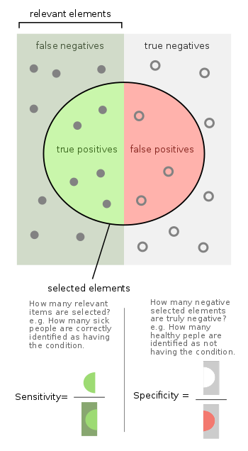

```{r setup, include=FALSE}
options(htmltools.dir.version = FALSE, width = 75)
knitr::opts_chunk$set(echo = TRUE, fig.align='center', dev='png', dpi = 95, out.width = "100%")
```


---

# Plan


Rappel : Modèle, OR, RR et test de significativité

I) Adequation du modèle aux données
II) Interprétation (et dangers!)
III) Prédiction (et dangers!)
IV) Introduction à la regression polytomique

---

## Rappel régression logistique : notation et modèle

### Principe

Objectif : Modéliser une **variable binaire** en fonction d’une ou plusieurs autres covariables (quali ou quanti)
$$Y \sim X$$
$$E(Y|X) \sim X$$

Par exemple, on cherche à connaitre la probabilité qu’un individu soit un homme sachant sa taille, son poids, ses habitudes alimentaires.


 - On pose Y la variable binaire,
 - X le vecteur des covariables/variables explicatives (qualitatives ou quantitatives)
 - On veut modéliser $E(Y|X) = f(X)$ avec $E(Y|X) = P(Y=1|X)$ noté $\pi (X)$

---

## Rappel régression logistique : notation et modèle

### La fonction *logit*


\begin{eqnarray}
              \text{logit: } ]0,1[ & \rightarrow & \mathbb{R} \\
                                 x & \rightarrow & logit(x)  =  log(\frac{x}{1-x}) \\ 
logit^{-1}(y) = \frac{1}{1+e^{-y}} & \rightarrow & y
\end{eqnarray}


### La régression logistique

Comme en régression linéaire, l’objet de cette modélisation est *d’estimer les coefficients $\beta$* :


\begin{eqnarray}
         logit(E(Y|X))    & = & \beta X             \\
          logit(P(Y=1|X)) & = & \beta X             \\
           logit(\pi(X)) & = & \beta X             \\
                  \pi(X) & = & logit^{-1}(\beta X) 
\end{eqnarray}

On obtient ainsi $\pi(X)$, le prédicteur de Y en fonction de X.

```{r}
d = read.table("data/data_nutri.csv", header=TRUE, sep=",", row.names = 1)
d$sex = as.factor(d$sex)
s = as.numeric(d$sex) - 1
#DT::datatable(d, width = "100%")
# head(d)
```

---

##  Rappel regression logistique :

 
### Les mesures d'interêt

Quel est l‘effet de la variable $X_k$ sur $logit(P(Y=1|X))$ ?


- *Définition*  **odds** 

$$Odds(X) = \frac{\pi(X)}{1-\pi(X)} \iff Odds(X) = e^{\beta X}$$

- *Définition*  **odds ratio** 

$$ OR_{u/\nu} = \frac{odd(X = u)}{odd(X=\nu)} = e^{\beta (u-v)}$$
 
 
- *Définition* **risque relatif** 

$$ RR_{u/\nu} = \frac{\pi(X = u)}{\pi(X=\nu)} = \frac{P(Y=1|X=u)}{P(Y=1|X=\nu)} $$


**$OR$ est directement calculable à partir des coefficients de la régression $\beta$**

$OR$ estime le rapport malades/non-malades et $RR$ estime le risque (i.e. la probabilité) d’être malade.

Ils donnent la même indication sur la relation entre $Y$ et $X$ :

1) Si $RR_{u/\nu}$ (ou $OR_{u/\nu}$) $>1$ alors il y a plus de risque de $Y=1$ si $X=u$ que si $X=\nu$
2) Si $RR_{u/\nu}$ (ou $OR_{u/\nu}$) $<1$ alors il y a moins de risque de $Y=1$ si $X=u$ que si $X=\nu$
3) Si $RR_{u/\nu}$ (ou $OR_{u/\nu}$) $=1$ alors $Y$ n’est pas influencée par $X=u$ vs. $X=\nu$ (i.e. Y indépendant des catégories $u$ et $\nu$ de $X$)


---

##  Rappel regression logistique :

### La significativité du paramêtre $\beta_k$

On veut tester l’influence du facteur $X_k$. Comment interpréter $\widehat{\beta_k}$ ?

$$\left\lbrace
\begin{array}{l}
H_0 : {\beta_k = 0} \\
H_1 : {\beta_k \neq 0}
\end{array}
\right.$$

Test de Wald pour un unique paramètre : $T = \Big(\frac {\widehat\beta_k} {\widehat\sigma_{\widehat\beta_k}}\Big)^2 \sim \mathcal{X}^2_1$

### Comparaison de modèles emboités

On veut tester si l’ajout de paramètres est pertinent.

 - Soit $m_1$ un modèle emboité dans $m_2$ (*i.e.* toutes les variables de $m_1$ sont dans $m_2$)
 - $m_2$ comprend $p$ variables explicatives supplémentaires par rapport à $m_1$
 - $L_1$ est la valeur de vraisemblance de $m_1$
 - $L_2$ est la valeur de vraisemblance de $m_2$
 
Test du rapport de vraisemblance : $T = -2(log(L_1) - log(L_2)) \sim \mathcal{X}^2_p$


---

## I) Adéquation du modèle

Comment mesurer si le modèle construit **prédit de façon efficace** les données observées ?

Mesurer l’**adéquation** du modèle **aux données** c’est étudier essentiellement :

- L’*écart global* entre les valeurs prédites et les valeurs observées (i.e. mesures globales)

-- Calibration du modèle (concordance entre les valeurs prédites et observées) : **Test de Hosmer-Lemeshow**

-- Pouvoir discriminant du modèle :  courbe **ROC** et critère **AUC** (Area Under Curve)


- La *contribution* de chaque observation au modèle (détection des outliers)

-- Résidus de Pearson 

-- Résidus de déviance


---

## I)  Adéquation du modèle : Test de Howmer-Lemeshow

### Principe

- Pour chaque observation $i$, on calcule la probabilité prédite $\widehat{P}(Y=1|x_i) = \widehat{\pi}(x_i)$.

- On regroupe les observations par quantiles de distribution de la valeur prédite (*i.e.* par valeurs croissantes en $K$ groupes $G_k$  de taille égale; on prend souvent $K=10$).

- Pour chaque groupe d’observations $G_k$ , on compare le nombre de sujets pour lesquels $Y=1$ ($n_{1k}$), au nombre de sujets malades prédits par le modèle ($\widehat{n}_{1k}$)

$$n_{1k} = \sum_{i\in{G_k}}y_i \ \ \ \ \ \ \ \ \ vs. \ \ \ \ \ \ \ \ \ \ \widehat{n}_{1k} = \sum_{i\in{G_k}}\widehat{\pi}(x_i)$$


- De même on calcule $n_{0k}$ et $\widehat{n}_{0k}$

$$n_{0k} = \sum_{i\in{G_k}} (1-y_i) \ \ \ \ \ \ \ \ \ vs. \ \ \ \ \ \ \ \ \ \ \widehat{n}_{1k} = \sum_{i\in{G_k}}(1-\widehat{\pi}(x_i))$$

- On compare ces valeurs observées $n_jk$ aux valeurs prédites  $\widehat{n}_jk$     (on voudrait idéalement qu’elles soient égales) par un test de $\mathcal{X}^2_{K-2}$ à $K-2$ degrés de libertés

Rq: il faut que pour tout $k$, $n_jk >5$ et $\widehat{n}_jk >5$ pour pouvoir appliquer ce test.

---

## I)  Adéquation du modèle : Test de Howmer-Lemeshow

### Exemple

$$H_0 : {\widehat{n}_{1k} = n_{1k}}, \forall j,k$$	
$$H_1 : \exists (j,k), \widehat{n}_{1k} \neq n_{1k} $$
On définit le modèle

```{r}
m = glm(s~d$poids+d$taille+d$age, family = binomial(logit))
```

Puis la probabilité prédite pour chaque observation

```{r}
prob_pred <- m$fitted.values
pred <- predict.glm(object = m, 
                    newdata = data.frame(d$poids,d$taille,d$age),
                    type = "response")
sum(pred == m$fitted.values)
hist(prob_pred,breaks=10)
```

On réalise le test

```{r}
test = ResourceSelection::hoslem.test (s, prob_pred)
```

La p-valeur du test de Hosmer-Lemeslow est > 0.05, on consreve $H_0$ et les valeurs prédites et observées concordent bien, le modèle est bon. 

Définition des groupes par quantiles de probabilités prédites $\widehat{\pi}(x_i)$

*Cutyhat*: Définition des groupes par quantiles de probabilités prédites $\widehat{\pi}(x_i)$

*y0 et y1*: $n_{jk}$ le nombre **observé** de sujets $Y=0$ et $Y=1$ par groupe


```{r}
c(quantile(prob_pred, 0.1),   
  quantile(prob_pred, 0.2),
  quantile(prob_pred, 0.3),
  quantile(prob_pred, 0.4),   
  quantile(prob_pred, 0.5),
  quantile(prob_pred, 0.6),
  quantile(prob_pred, 0.7),   
  quantile(prob_pred, 0.8),
  quantile(prob_pred, 0.9)
  )
#pour le premier quantile
idx= which(prob_pred < quantile(prob_pred, 0.1))
sum(s[idx])
sum(1-s[idx])
test$observed

```

*yhat0 et yhat1*: $n_{jk}$ le nombre **estimé** de sujets $Y=0$ et $Y=1$ par groupe

Le nombre estimé d'événements n'est que la somme des probabilités prédites sur les individus du groupe

```{r}
#pour le premier quantile
idx= which(prob_pred < quantile(prob_pred, 0.1))
sum(prob_pred[idx])
sum(1-prob_pred[idx])
test$expected

```


---

## I)  Adéquation du modèle : courbe ROC

### Principe

Le **pouvoir discriminant** correspond à la capacité du modèle à correctement classer les observations.

- Pour chaque observation $i$, on calcule la probabilité prédite $\widehat{P}(Y=1|x_i) = \widehat{\pi}(x_i)$.

- On définit pour un seuil $s \in [0,1]$ choisi :
$$ \widehat{Y}_i = \Bigg\{
\begin{align}
1 && \text{si} && \widehat{\pi}(x_i) \geq s \\ 
0 && \text{sinon}
\end{align}
$$

- La **proportion de bien classés** correspond à :
$$ \frac{\# \{\widehat{Y}_i = 1, Y_i = 1\} + \# \{\widehat{Y}_i = 0, Y_i = 0\}}{n} $$




- La **Sensibilité** (or True Positive Rate, TPR) correspond à la proportion de bien classées parmi les observations pour lesquelles $Y=1$, $$ sensibilité = \frac{\# \{\widehat{Y}_i = 1, Y_i = 1\}}{\# \{Y_i = 1\}} =  \frac{TP}{P} =  \frac{TP}{TP + FN}$$


- La **Spécificité** (or True Negative Rate, TNR)correspond à la proportion de bien classées parmi les oservations pour lesquelles $Y=0$, $$spécificité =  \frac{\# \{\widehat{Y}_i = 0, Y_i = 0\}}{\# \{Y_i = 0\}} =  \frac{TN}{N} =  \frac{TN}{TN + FP}$$

- On cherche à **maximiser sensibilité et spécificité** en faisant varier $s \in [0,1]$

---

## I)  Adéquation du modèle : courbe ROC

### Exemple


On recherche le seuil $s$ optimum (souvent le plus proche de $sensibilité=1$ et $spécificité=1$)

```{r}
m = glm(s~d$poids+d$taille+d$age, family = binomial(logit))
ROC = pROC::roc(response=s, m$fitted.values)
plot(ROC, xlim=c(1,0))
```

On recherche le seuil pour lequel on maximise la sensibilité et la spécificité).


```{r}
plot(ROC, xlim=c(1,0))
test = (1-ROC$sensitivities)^2+(1-ROC$specificities)^2
wh = which(test==min(test))
ROC$thresholds[wh]
ROC$specificities[wh] # True Negative Rate
ROC$sensitivities[wh] # True Positive Rate
points(ROC$specificities[wh], ROC$sensitivities[wh], col = 2, cex = 2, lwd = 2)
```

--- 

## I)  Adéquation du modèle : AUC

### Principe

AUC signifie "aire sous la courbe ROC". 

AUC           | Discrimination
------------- | -------------
0.5           | Nulle
0.7 - 0.8     | Acceptable
0.8 - 0.9     | Excellente
> 0.9         | Exceptionnelle

Plus l’aire sous la courbe augmente, plus le modèle est capable de bien classer les observations:

- Si $AUC = 0.5$ alors le modèle classe de manière complètement aléatoire les observations

- Si $AUC > 0.9$ le modèle est très bon, voire trop bon, il faut évaluer s’il y a overfitting
 
--- 

## I)  Adéquation du modèle : AUC

## Exemple

```{r}
m1 = glm(s~d$poids, family = binomial(logit))
m2 = glm(s~d$taille, family = binomial(logit))
m3 = glm(s~d$taille+d$poids, family = binomial(logit))
pROC::roc(response=s, m1$fitted.values)
ROC1 = pROC::roc(response=s, m1$fitted.values)
pROC::roc(response=s, m2$fitted.values)
ROC2 = pROC::roc(response=s, m2$fitted.values)
pROC::roc(response=s, m3$fitted.values)
ROC3 = pROC::roc(response=s, m3$fitted.values)
plot(ROC1, xlim=c(1,0), col=2)
lines(ROC2, xlim=c(1,0), col=4)
lines(ROC3, xlim=c(1,0), col="grey")
legend("bottomright", lty=1, c("s~poids", "s~taille", "s~taille+poids"), col=c("2", "4", "grey"))
```


---


## I)  Adéquation du modèle : les résidus


Résidus de Pearson :

$$ r_{p_i} = \frac{Y_i - \widehat{\pi}_i}{\sqrt{\widehat{\pi}_i(1-\widehat{\pi}_i)}} $$

Résidus de déviance : 


$$r_{D_i} = \left  \lbrace
\begin{array}{l}
\sqrt(2|log(\widehat{\pi}_i)|)      \ \ \ \  \text{si}\  Y_i=1  \\
 - \sqrt(2|log(1-\widehat{\pi}_i)|) \ \ \ \  \text{si}\  Y_i=0
\end{array}
\right.$$

Sujet i mal modélisé si $|r_{p_i}|$ ou  $|r_{D_i}| > 2$ 

On estime alors le modèle après exclusion de ces individus pour étudier la robustesse du modèle


Une valeur extrême peut être:

- exacte et il convient alors de ne pas modifier dans la base de données. 
- une valeur aberrante, c’est-à-dire qui est fausse et qui ne passe pas inaperçu.

Une grande valeur de résidu peut indiquer des données individuelles aberrantes 
mais des données individuelles peuvent être aberrantes sans que le résidu soit important. 

```{r}
plot(residuals(m, type="deviance") , xlab="",ylab="Deviance residuals")
plot(residuals(m, type="pearson") , xlab="",ylab="Pearson residuals")
idx = which(residuals(m, type="pearson")>2)
d[idx,]
```

```{r}
d$s =s 
m_all  = glm(s~d$taille+d$poids, family = binomial(logit))
m_cor = glm(s~ taille+poids, 
            data = d[-idx, ],
            family = binomial(logit))
ROC1 = pROC::roc(response=s, m_all$fitted.values)
pROC::roc(response=s, m_all$fitted.values)
pred <- predict.glm(object = m_cor, newdata = d, type = "response")
ROC2 = pROC::roc(response=s, pred)
pROC::roc(response=s, pred)
pred <- predict.glm(object = m_cor, newdata = d[-idx, ], type = "response")
ROC3 = pROC::roc(response=s[-idx], pred)
pROC::roc(response=s[-idx], pred)
plot(ROC1, xlim=c(1,0), col=2)
lines(ROC2, xlim=c(1,0), col=4)
lines(ROC3, xlim=c(1,0), col="grey")
legend("bottomright", lty=1, c("all", "corr on all", "corr on corr"), col=c("2", "4", "grey"))

```

---

## II) Interprétation du modèle :
### Les facteurs d'ajustement

*Définition*: les facteurs d''ajustement sont des facteurs qui affectent l'association entre la variable observée et les variables explicatives et qui provoquent des erreurs dans l'interprétation des liens entre ces deux variables. Pour étudier correctement l’effet des covariables X sur la variable d’intérêt Y, il faut prendre en compte les facteurs d'ajustement.

- Les facteurs **modifiant l’effet de X sur Y** (eg. le sexe pour certaines maladies)

- Les facteurs **caractérisant la mesure** (eg. L’effet enqueteur, ou plaque pour des mesures biologiques…)

- Les **facteurs de confusion** pour l’association entre X et Y

La littérature aide à déterminer quels facteurs d’ajustement on doit retenir

Rq: si on inclue trop de facteurs dans un modèle (i.e. >5-10% du nombre d’observations), on diminue la précision des estimateurs, qui peuvent devenir instables, imprécises et biaisées.

---

## II)  Interprétation du modèle :
### Exemple des facteurs de confustion 

*Définition*: $Z$ est un facteur de confusion si:

- $Z$ (tabac) est une cause de $Y$ (maladie)

- $Z$ (tabac) est associé à $X$ (café), mais n’est pas une conséquence de $X$ (café)

Ne pas prendre un compte ce facteur $Z$ (tabac) peut créer un **biais d’association** entre $X$ (café) et $Y$(maladie)


---

## II) Interprétation du modèle :
### Exemple des facteurs de confusion 

En pratique, on retient $Z$ comme facteur de confusion si ces deux conditions sont remplies:

- $Z$ est associé à $Y$ (i.e. p-valeur du test de Wald <0.1)

- ajouter $Z$ au modèle modifie d’effet d’une covariable (changement du coefficient $\beta$ associé <10%)


Rq: 

- la notion de facteur de confusion dépend des variables prises en compte, elle n’est pas absolue

- Il est aussi grave d’oublier un facteur de confusion que de prendre en compte un facteur qui n’est pas confondant.

- Il est souvent difficile de déterminer les facteurs de confusion, qui restent «présumés».

---

## II) Interprétation du modèle :
### Exemple des facteurs de confusion 


```{r}
d = read.table("data/data_nutri.csv", header=TRUE, sep=",", row.names = 1)
d$sex = as.factor(d$sex)
#DT::datatable(d, width = "100%")
s = as.numeric(d$sex) - 1
```

(1) Calcul des OR en univarié

```{r}
m1_taille = glm(s~d$taille, family = binomial(logit))
m1_taille$coefficients
summary(m1_taille)$coefficient
OR_mod1_taille = exp(summary(m1_taille)$coefficient[2,1])
```


```{r}
m1_the = glm(s~d$the, family = binomial(logit))
m1_the$coefficients
summary(m1_the)$coefficient
OR_mod1_the = exp(summary(m1_the)$coefficient[2,1])
```

(2) Calcul des OR en multivarié

```{r}
m2 = glm(s~d$taille + d$the, family = binomial(logit))
m2$coefficients
summary(m2)$coefficient
OR_mod2_taille = exp(summary(m2)$coefficient[2,1])
OR_mod2_the = exp(summary(m2)$coefficient[3,1])
```

```{r}
OR_mod1_taille 
OR_mod2_taille
OR_mod1_the 
OR_mod2_the
```
 
(3) Interprétation

Si **différence** entre cas 1 et cas 2:

   - Facteur de confusion (différence majeure)
   
   - Informations redondantes (corrélation ou colinéarité  si plus de deux facteurs)
   
Si **pas de différence** entre cas 1 et cas 2:

   - X1 et X2 sont des facteurs indépendants et tenir compte de l'effet de X2 ne change rien sur l'effet de X1

---

## II) Interprétation du modèle :
### Type de variable 

On cible une variable d’intérêt, qu’on mesure par l’intermédiaire d’une variable aléatoire.

On distingue:

- La nature «réelle» de la variable d’intérêt

- La nature de la variable aléatoire mesurée

- Le codage de cette variable aléatoire

Exemple: l’âge 

Cette variable d’intérêt est de nature continue. Elle peut représenter synthétiquement beaucoup de notions complexes: le vieillissement biologique, l’exposition cumulée à des polluants, le risque de maladie spécifique à certaines tranches d’âges…

La variable aléatoire âge est mesurée en jours/mois/années. 
Théoriquement, c’est donc une variable discrète (i.e. nombre limité de valeurs possibles, eg. sur une population d’enfant avec âge en années), mais on le considère souvent comme de nature continue.

On peut aussi le catégoriser/coder en tranches d’âges (ex. de codage: <35 ans, 35-45 ans, 45-55 ans, >55 ans) 

---

## II) Interprétation du modèle :
### Encodage des variables

#### Codage

- Eviter de faire des hypothèses arbitraires sur la relation variable explicative- variable expliquée (chercher dans la littérature, par « bon sens» en lien avec nos à priori biologiques, par observation des données, tests, etc.)

- Prendre en compte dans un modèle une variable mal codée peut s’avérer pire que de ne pas la prendre en compte 

#### Transformation 

- Toute variable peut être **transformée** avant de l’inclure dans un modèle, eg.
Passée au logarithme, à l’exponentiel, catégorisée pour une variable continue
Regrouper les catégories pour une variable catégorielle

- Attention à bien définir la **catégorie de référence** pour les variables catégorielles

---

## II) Interprétation du modèle :
### Causalité 

**ATTENTION**

Association n’est pas causalité!

Les modèles mettent en lumière des associations, mais on ne sait pas lesquelles sont causales. 

En santé par exemple, il faudrait comprendre le processus biologique pour conclure à une causalité.

---

## II) Interprétation du modèle :
### Résumé

Procédure communément utilisée de sélection de modèle:

1) Effectuer une première sélection par des tests univariés (au risque de 0.05, 0.10 ou 0.20) surtout quand on a un grand nombre de variables d’ exposition

2) A partir de cette première sélection, chercher le modèle multivarié approprié (plusieurs procédures pas a pas peuvent etre testées)

3) Tester les interactions entre variables du modèle multivarié retenu

4) Au final, ne retenir que les variables significatives simultanément. Retenir les effets principaux quand on retient une interaction.

---

# Plan

I) Rappel : Modèle, OR, RR et test de significativité
II) Interprétation (et dangers!)
III) Prédiction (et dangers!)
IV) Introduction à la regression polytomique


---

## III) Prédiction du modèle 

Objectif de la modélisation est soit:

- **Explicatif** : chercher la meilleure association de variables
explicatives pour expliquer Y  -> *notion de parcimonie*

- **Prédictif** : chercher la meilleure association de variables
explicatives pour prédire Y -> *pas toujours parcimonieux*

On distingue deux types de prédictions

- La valeur prédite par le modèle pour l’individu $i$ est:

$$logit(\pi(X)) = logit(\widehat P(Y_1 = 0 | X = x_i)) = \widehat \beta x_i$$
- La probabilité estimée d’évènement $Y=1$ est:

$$\pi(X) = logit^{-1}(\beta X)$$
$$\widehat P(Y_1 = 1 | X = x_i)  = logit^{-1}(\beta X) = \frac{e^{\widehat\beta x_i}}{1 + e^{\widehat\beta x_i}} $$

---

## III) Prédiction du modèle 
### Exemple d'application 

Prediction de $logit(\pi(X)) =  \widehat \beta x_i$

```{r}
m= glm(s~taille+poids, d,family = binomial(logit))
logit.pi.hat = predict(m,newdata = data.frame(taille = 168, poids = 75), se.fit = TRUE)
logit.pi.hat$fit

```

Prediction de $\widehat \pi(X) =  \frac{e^{\widehat\beta x_i}}{1 + e^{\widehat\beta x_i}}$

```{r}
pi.hat = exp(logit.pi.hat$fit)/(1+exp(logit.pi.hat$fit))
pi.hat.resp = predict.glm(m,newdata = data.frame(taille = 168, poids = 75), type = "response", se.fit = TRUE)
pi.hat
pi.hat.resp$fit
```

Predication de l'interval de confiance $IC_{95}(\widehat \pi(X))$

```{r}
ci = c(pi.hat.resp$fit - 1.96*pi.hat.resp$se.fit, pi.hat.resp$fit+ 1.96*pi.hat.resp$se.fit)
exp(ci)/(1+exp(ci))
```

---

# Plan

I) Rappel : Modèle, OR, RR et test de significativité
II) Interprétation (et dangers!)
III) Prédiction (et dangers!)
IV) Introduction à la regression polytomique

---

## IV) Introduction à la regression polytomique 

Extension du modèle logistique à une variable expliquée **multinomiale** (au lieu de binomiale). Ce modèle est appelé **régression logistique polytomique** (à variable dépendante nominale) ou **régression logistique multinomiale**

i.e.  $Y$ est qualitative nominale à $K (K > 2)$ modalités. 

Il faut pour cela prendre une modalité de référence $u$ , et estimer $(K-1)$ logits, i.e. pour tout $k$ différent de $u$:


$$ln \Big(\frac{P(Y=k|X)}{P(Y=u|X)}\Big) = \beta_kX $$

Rq:

- Il existe différentes manières de définir les logits

- Les équations ( et donc les estimations) sont indépendantes pour chaque valeur de $k$

- Les mêmes variables explicatives sont utilisées pour chacune des équations

---

## IV) Introduction à la regression polytomique 
### Exemple

```{r, eval = TRUE}
table(d$poisson)
d$s = s
library(VGAM)
m= vglm(poisson~s+poids, family = multinomial, data = d)
summary(m)


```

$ln \Big(\frac{P(Y=k|X)}{P(Y=u|X)}\Big) = \beta_kX$ correspond aux prédicteurs linéaires:

`log(mu[,1]/mu[,6]), log(mu[,2]/mu[,6]), log(mu[,3]/mu[,6]), log(mu[,4]/mu[,6]), log(mu[,5]/mu[,6])`

---

## Mise en pratique

Quelques exercices à réaliser sous R disponibles:

- [TP2](TP2_reglog_M2.pdf)

- [TP3](TP3_reglog_M2.pdf)